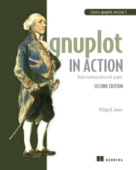

# Gnuplot in Action, Second Edition

Examples and code for the book _Gnuplot in Action (Second Edition)_
by Philipp K. Janert (Manning, 2016)




## Description

This repository contains the command files, data sets, and other
files necessary to run the examples in the book.


## Organization

The downloads are organized into three directories:

- `datasets` : data sets
- `gnuplot` : gnuplot command files
- `misc` : files in other formats (Perl, Python, Latex, HTML)

**Please note:** To avoid possible copyright issues, publicly available
data sets are not replicated in this repository. Instead, the URL where
the data set can be found is given in a file with the extension `.readme`.


## Running the Examples

To run the examples, proceed as follows:

1. change into the `datasets` directory (_not_ into the `gnuplot` directory!)
2. start `gnuplot`
3. issue `gnuplot` commands from the book, like so:

   ```
   plot "marathon" using 1:2 with boxes
   ```

3. Or you can load a command file using the `load` command and the relative
path, like so:

   ```
   load "../gnuplot/orders.gp"
   ```

### Downloading the Examples

To download the examples, you may clone the repository:

```
git clone git://github.com/janert/gnuplot-in-action-2e
```

Alternatively, download all the files as zipped archive from:

```
https://github.com/janert/gnuplot-in-action-2e/archive/master.zip
```

(or using the green button in the top right corner of this page), then
unpack them using:

```
unzip gnuplot-in-action-2e--master.zip
```

## Resources

- Catalog Page at Manning: https://www.manning.com/books/gnuplot-in-action-second-edition


## Author

Philipp K. Janert
